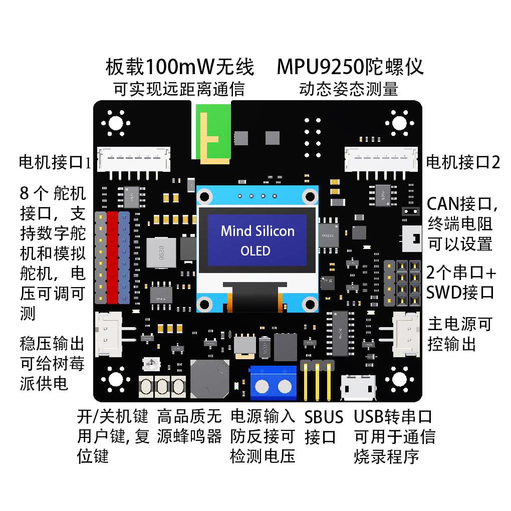
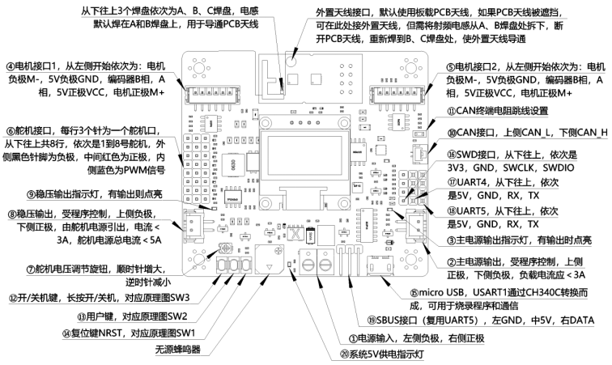
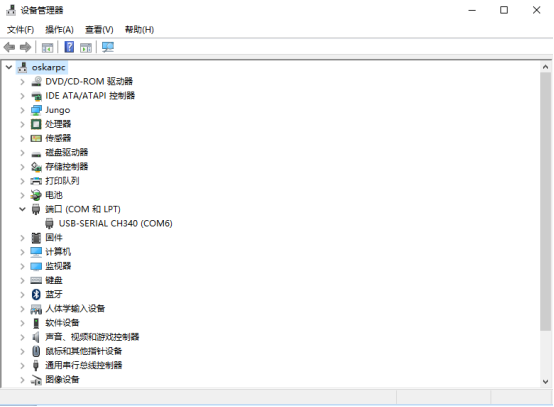
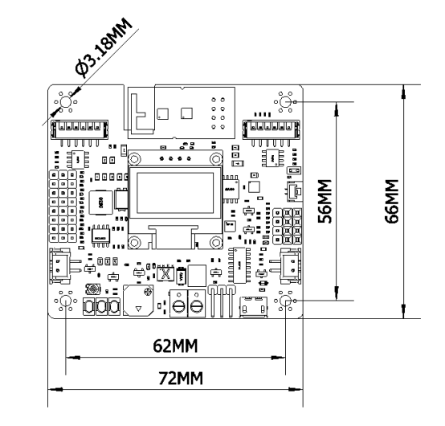

Tank Dual开发板是一款专门为机器人项目开发的STM32多功能控制板，可以同时控制8个舵机和2个编码电机，板载MPU9250姿态传感器，自带100mW无线可实现远距离遥控、通信，支持CAN通信，USB烧录/通信，串口通信等。稳压输出可以对外给树莓派供电，控制外部负载。
主控：STM32F103RCT6，72MHz，ARM-Cortex M3内核，主流学习平台。
无线：板载100mW无线模块，频段2.4GHz，可设置地址和频道。自带PCB天线距离轻松超过200米，可接外置天线距离可达500米，可本店手柄配套使用。
9轴传感器：MPU9250（3轴陀螺仪+3轴加速度+3轴磁力计）
舵机接口：8路硬件PWM舵机接口，5A大电流稳压芯片，可调电压。
电机接口：2路直流有刷电机接口，支持正交编码器，每路3A大电流，支持12/24V电机。
OLED屏幕：0.96寸OLED，可以显示信息，播放开关机动画。
USB转串口：板载1路USB转串口电路，可以与电脑或树莓派USB通信，可以通过USB烧录程序。
串口：2路串口（1路可以用作SBUS，与航模SBUS接收机通信）。
CAN通信：1路CAN接口（带跳线电阻）。
存储：板载W25Q64闪存芯片，内置文件系统，方便保存数据。
声光提示：无源蜂鸣器，可以播放音乐，1路系统LED，3路电源LED。
按键：开机/关机键，复位键，1个用户自定义按键。
电源输入：6～24V供电，支持对外3A可控输出，可测量电压。
稳压输出：支持对外3A稳压输出，与舵机共用稳压电源，开关可控，可测量电压，可以给树莓派供电。（舵机和稳压输出总和不可超过5A）。
调试接口：SWD接口。

上图中需要注意的是：
⑫开/关机键，长按可以开/关机，对应原理图SW3。在USB和主电源同时供电时，程序会自动运行，但仍需通过按键开机后主电源才会启动，电机和舵机才会得到电力供应。
⑬用户键，对应原理图SW2，可通过程序来实现自定义功能。
⑭复位键NRST，对应原理图SW1，按下后使STM32复位。程序执行异常，或者通过SWD下载程序出错时可以尝试通过复位排除问题。
①主电源接口为整个系统的供电接口，左侧负极，右侧正极，支持2~6S电池输入。
②主电源输出口电压与主电源接口输入电压相同，接口类型为XH2.54-2P，上侧正极，下侧负极，负载电流应＜3A，输出受程序控制。只能输出，不可用于输入。
③主电源输出指示灯，当主电源输出口有输出时点亮。
④⑤电机接口为PH2.0-6P接口，线序为M-、5V-、B、A、VCC、M+，在连结电机时请确保线序正确。电机驱动电压与主电源接口输入电压相同。、
⑥舵机接口，每行3个针为一个舵机口，从下往上共8行，依次是1到8号舵机，外侧黑色针脚为负极，中间红色为正极，内侧蓝色为PWM信号。为了匹配不同电压规格的舵机，舵机口的电压是可以通过⑦调节的。
⑦电压调节旋钮，可以调节⑥舵机接口和⑧稳压输出电压，顺时针增大，逆时针减小。
⑧稳压输出接口，接口类型为XH2.54-2P，输出受程序控制，上侧负极，下侧正极。负载电流应＜3A，可以用于给树莓派供电。由于稳压输出是从舵机电源中引出，它的电压同样受⑦控制，且和舵机电源总电流应＜5A。给树莓派供电时，请务必注意使稳压输出电压≤5V，且确认好正、负极接线正确，否则将烧坏树莓派。
⑨稳压输出指示灯，当稳压输出口有输出时点亮。
⑩CAN接口，接口类型为GH1.25-2P，上侧CAN_L，下侧CAN_H。
⑪CAN终端电阻跳线设置，跳线帽为2.0毫米规格。
⑮micro USB，USART1通过CH340C转换而成，可用于烧录程序和通信。当无法通过SWD下载程序时，也可以通过USB下载程序。
⑯SWD接口，从下往上，依次是3V3，GND，SWCLK，SWDIO。此处的3V3即3.3V，只可用于编程器烧录，不可对外供电。
⑰UART4，从下往上，依次是5V，GND，RX，TX，此处的5V外接负载电流应＜50mA。
⑱UART5，从下往上，依次是5V，GND，RX，TX，此处的5V外接负载电流应＜50mA。
⑲SBUS接口（复用UART5），左GND，中5V，右DATA，此处的5V外接负载电流应＜50mA。
⑳系统5V供电指示灯。
2.2无线介绍
无线发射功率100mW，频段2400 ~ 2525MHz。
可通过上位机软件设置无线地址和频道，见下文。
3、注意事项
控制板可以通过SWD接口或USB接口烧录程序，SWD烧录速度快且支持调试，USB接口可以在没有编程器（ST-Link或JLink）的情况下完成烧录工作。
SWD烧录可以直接在Keil中完成，烧录时需要通过USB供电，如果用主电源供电，则需要按住开机键不要松开。
SWD烧录中，如果Keil提示内部异常、内部错误，一般是由于STM32没有响应编程器的复位指令，需要手动按住板子上的复位键，同时点击Keil中的下载按钮（或者按下F8），然后迅速松开复位键，程序即可下载到芯片中。
开/关机动画保存在外置Flash芯片W25Q64中，不会因为重新烧录程序而丢失。格式化外置Flash芯片或者删除芯片中的资源文件，将导致开/关机动画丢失，但不会影响其他功能。
4、通信协议
4.1通信数据格式
该通信协议适用于手柄、控制板和上位机三者之间的通信。手柄，接收机，上位机软件，受控设备之间，所有通信内容均用16进制表示，小端模式（低字节在前，高字节在后），单次通信数据长度不可超过32字节。
格式：帧头 + 通信代码 + 帧长度 + 数据 + 校验
其中具体含义为：
帧头：2字节，固定为0xAAAA，用于表示一次通信的开始，或者区分不同数据帧。
通信代码：1字节，用来区分通信的类型，详见表4.1。
帧长度：1字节，本次通信数据帧长度，指包含帧头、通信代码、帧长度、数据和校验在内的总长度。
数据：若干字节，数据载荷，长度可变。
校验：16位CRC校验值，MODBUS格式。详见表4.2。
表4.1	通信代码说明
通信代码	说明
0x01	遥控指令，这是一条从手柄发往接收机的指令。手柄通过这条指令将摇杆、按键、手柄电量在内的所有信息发送给接收机，接收机再通过串口输出。发送频率为50Hz。
0x09	反馈指令，这是一条从接收机发往手柄的指令，用来触发手柄震动。用户通过接收机的串口把这条指令发送给接收机，然后接收机通过无线发送给手柄，手柄发出震动。没有发送频率限制，用户可以根据需要去触发手柄震动。
0x15	下行透传指令，上位机通过USB把指令发送给手柄，手柄将指令发送给接收机，然后接收机通过串口输出。注意：长度不可以超过26字节。
0x16	上位机发送指令给控制板，设置8个舵机的PWM值和电机转速值，使能稳压输出和主电源输出。此指令会启动内部PID调速算法，请确保电机霍尔编码器正常。
0x1D	上行透传指令，用户通过接收机的串口把这条指令发送给接收机，然后接收机通过无线发送给手柄，手柄通过USB接口输出该指令。注意：长度不可以超过26字节。

表4.2	CRC算法说明
CRC算法	多项式公式	宽度	多项式	初始值	异或值	输入反转	输出反转
MODBUS	x16 + x15 + x2 + 1	16	8005	0xFFFF	0x0000	true	true
CRC算法的参考程序，见例程或校准软件。CRC16计算页面链接（注意选MODBUS算法）http://www.ip33.com/crc.html

4.2通信示例
0x01指令：该指令是所有指令中最重要的指令，只有理解它的含义，才可以弄清楚手柄是如何控制其他设备的。指令中所有数据均为16进制，下边给出0x01指令的具体示例：
示例：AA AA 01 0D DF 7F 7F 7F 7F 00 00 D7 51
第1、2字节0xAA，0xAA为帧头，标志着一帧数据的开始。
第3字节0x01为命令代码。
第4字节0x0D为帧长度，这条指令长度为13个字节，用16进制表示就是0x0D。
第5字节0xDF表示手柄电池此时的电压，计算公式：（0xDF +200）÷100=4.23V，此时手柄电池电压为4.23V，其它值时以此类推。手柄低电量提醒电压为3.8V，自动关机电压为3.75V。
第6字节为模拟通道1，对应手柄左侧摇杆的水平方向，取值范围为0x00~0xFF，中值为0x7F。摇杆往左打极限值为0xFF，往右打极限值为0x00。
第7字节为模拟通道2，对应手柄左侧摇杆的垂直方向，取值范围为0x00~0xFF，中值为0x7F。摇杆往下打极限值为0xFF，往上打极限值为0x00。
第8字节为模拟通道3，对应手柄右侧摇杆的水平方向，取值范围为0x00~0xFF，中值为0x7F。摇杆往左打极限值为0xFF，往右打极限值为0x00。
第9字节为模拟通道4，对应手柄右侧摇杆的垂直方向，取值范围为0x00~0xFF，中值为0x7F。摇杆往下打极限值为0xFF，往上打极限值为0x00。
第10、11字节，这两个字总共16位，对应手柄的16个通道。从最高位第16位到第1位，依次是：L2、L1、LU、LL、LD、LR、SE、ST、RL、RD、RR、RU、R1、R2、R-KEY、L-KEY。其中R-KEY和L-KEY为摇杆往下按对应的按键。
第12、13字节为校验值，计算前11个字节的CRC16校验值得到0x51D7，按照小端模式，低字节0xD7，高字节0x51依次排列。

0x09指令：接收机发往该指令给手柄，用于触发手柄震动。
示例：AA AA 09 07 01 0E 32
第1、2字节0xAA，0xAA为帧头，标志着一帧数据的开始。
第3字节0x09为命令代码。
第4字节0x07为帧长度，这条指令长度为7个字节。
第5字节0x01表示触发手柄左侧电机振动，如果要触发邮册电机则应为0x02。该字节只能取0x01或者0x02。
第6、7字节为校验值，计算前5个字节的CRC16校验值得到0x320E，按照小端模式，低字节0x0E，高字节0x32依次排列。

0x15指令：上位机通过手柄透传给接收机的数据，然后通过接收机输出给STM32进行处理。
示例：AA AA 15 07 00 0E 34
第1、2字节0xAA，0xAA为帧头，标志着一帧数据的开始。
第3字节0x15为命令代码。
第4字节0x07为帧长度，这条指令长度为7个字节。
第5字节0x00上位机发出的数据，字节长度可变，但不可超过26字节。因为一次通信最多发送32字节数据，其他部分已占据6字节。
第6、7字节为校验值，计算前5个字节的CRC16校验值得到0x340E，按照小端模式，低字节0x0E，高字节0x34依次排列。
可以通过这条指令来模拟手柄向开发板发送的数据，格式参照0x01指令。可以用于实现上位机通过控制板的USB口向控制板发送指令数据，控制板像响应手柄指令一样做出相同响应，具体实现由用户决定。

0x16指令：上位机发送指令给控制板，设置8个舵机的PWM值和电机转速值，启动稳压输出和主电源输出。PWM有效范围是500~2500μS，PWM频率为50Hz。每个电机的转速值用2个字节（BYTE1，BYTE2，简写为B1、B2）表示。B1字节的最高2位用来表示：惯性滑行（00）、正转（01）、反转（10）、阻尼刹车（11）。B1字节低6位和B2字节8位共同组成速度值(((B1 & 0x3F)<< 8) | B2)。当B1高2位为正转（01）或者反转（10）时，如果速度值为0则会锁定电机位置，使电机迅速停转并保持不动。电机速度的单位为毫米每秒（mm/s），表示电机转动所产生的线速度。
示例：AA AA 16 1B 00 00 00 00 00 00 00 00 00 00 00 00 00 00 00 00 00 00 00 00 00 5E A6
             舵机：1    2    3    4    5    6    7    8   B1B2 B1B2 PWR
第1、2字节0xAA，0xAA为帧头，标志着一帧数据的开始。
第3字节0x15为命令代码。
第4字节0x1B为帧长度，这条指令长度为27个字节，即十六进制0x1B。
第5 ~ 20字节依次为1至8舵机口的PWM值，每个舵机占用2个字节，注意PWM有效范围是500~2500μS，PWM频率为50Hz。
第21~24字节依次为电机1接口和电机2接口的转速值。每个电机的转速值用2个字节（BYTE1，BYTE2，简写为B1、B2）表示。B1字节的最高2位用来表示：惯性滑行（00）、正转（01）、反转（10）、阻尼刹车（11）。B1字节低6位和B2字节8位共同组成速度值(((B1 & 0x3F)<< 8) | B2)。当B1高2位为正转（01）或者反转（10）时，如果速度值为0则会锁定电机位置，使电机迅速停转并保持不动。电机速度的单位为毫米每秒（mm/s），表示电机转动所产生的线速度。
直流减速电机转速一般在1000RPM（转每分钟）以内，根据电机转速和车轮直径可以算出车轮线速度的合理区间。请注意输入合理的速度值，以免电机过载。需要特别注意的是，此指令会启动内部PID调速算法，请确保电机编码器正常，编码器异常可能导致灾难性后果。
第25字节PWR用于启动稳压输出和主电源输出，0x00表示不启动，0x01表示仅启动舵机电源用于对外提供稳压供电，0x02表示仅启动主电源输出口对外供电，0x03表示同时启动多机电源和主电源。注意启动前务必检查舵机电源和主电源电压，以免烧坏外接设备。另外，请确保系统主电源已经接通且开启，参考2.1章节接开关机操作。
第26、27字节为校验值，计算前25个字节的CRC16校验值得到0xA65E，按照小端模式，低字节0x5E，高字节0xA6依次排列。

0x1E指令：控制板对上位机0x16指令的返回信息，用来返回设置是否成功，以及电机转速、设备姿态、故障信息。
示例：AA AA 1E 11 00 00 00 00 00 00 00 00 00 00 00 7F F6
B1B2 B1B2  R    P    Y
第1、2字节0xAA，0xAA为帧头，标志着一帧数据的开始。
第3字节0x1E为命令代码。
第4字节0x11为帧长度，这条指令长度为17个字节。
第5字节0x00表示设置完成，0x1表示霍尔故障，0x02表示电机过载，0x03表示因为即将接触障碍物而触发制动，0x04表示因为即将跌落而触发制动。
第6~9字节依次为电机1接口和电机2接口的转速值。每个电机的转速值用2个字节（BYTE1，BYTE2，简写为B1、B2）表示。B1字节的最高2位用来表示：惯性滑行（00）、正转（01）、反转（10）、阻尼刹车（11）。B1字节低6位和B2字节8位共同组成速度值(((B1 & 0x3F)<< 8) | B2)。当B1高2位为正转（01）或者反转（10）时，如果速度值为0则会锁定电机位置，使电机迅速停转并保持不动。电机速度的单位为毫米每秒（mm/s），表示电机转动所产生的线速度。
第10~15字节依次为姿态数据：横滚角Roll、俯仰角Pitch、偏航角Yaw，每个角度包含2个字节（16位有符号整型，小端模式），需要除以10才是实际角度值。比如Roll值为0x7A，换算成十进制为122，那么实际Roll角度为12.2°。
第16、17字节为校验值，计算前5个字节的CRC16校验值得到0xF67F，按照小端模式，低字节0x7F，高字节0xF6依次排列。

0x17指令：读取控制板信息，包括8个舵机的PWM值和电机转速值，稳压输出状态和主电源输出状态，舵机电压（同稳压输出电压）和主电源电压。
示例：AA AA 17 06 8E 2E
第1、2字节0xAA，0xAA为帧头，标志着一帧数据的开始。
第3字节0x17为命令代码。
第4字节0x06为帧长度，这条指令长度为6个字节。
第5、6字节为校验值，计算前4个字节的CRC16校验值得到0x2E8E，按照小端模式，低字节0x8E，高字节0x2E依次排列。

0x1F指令：对0x17指令的响应，用于返回控制板信息，其中包括8个舵机的PWM值和电机转速值，稳压输出状态和主电源输出状态，舵机电压（同稳压输出电压）和主电源电压。
示例：AA AA 1F 1D 00 00 00 00 00 00 00 00 00 00 00 00 00 00 00 00 00 00 00 00 00 00 00 8D 16
             舵机：1    2    3    4    5    6    7    8   B1B2 B1B2 PWR
第1、2字节0xAA，0xAA为帧头，标志着一帧数据的开始。
第3字节0x1F为命令代码。
第4字节0x1D为帧长度，这条指令长度为29个字节。
第5 ~ 20字节依次为1至8舵机口的PWM值，每个舵机占用2个字节，注意PWM有效范围是500~2500μS，PWM频率为50Hz。注意数据格式为小端模式（低字节在前，高字节在后），比PWM值1500用十六进制表示为0x05DC，发送顺序为先发0xDC，后发0x05。
第5 ~ 20字节依次为1至8舵机口的PWM值，每个舵机占用2个字节，注意PWM有效范围是500~2500μS，PWM频率为50Hz。
第21~24字节依次为电机1接口和电机2接口的转速值。每个电机的转速值用2个字节（BYTE1，BYTE2，简写为B1、B2）表示。B1字节的最高2位用来表示：惯性滑行（00）、正转（01）、反转（10）、阻尼刹车（11）。B1字节低6位和B2字节8位共同组成速度值(((B1 & 0x3F)<< 8) | B2)。当B1高2位为正转（01）或者反转（10）时，如果速度值为0则会锁定电机位置，使电机迅速停转并保持不动。电机速度的单位为毫米每秒（mm/s），表示电机转动所产生的线速度。
第25字节PWR用于启动稳压输出和主电源输出，0x00表示不启动，0x01表示仅启动舵机电源用于对外提供稳压供电，0x02表示仅启动主电源输出口对外供电，0x03表示同时启动多机电源和主电源。注意启动前务必检查舵机电源和主电源电压，以免烧坏外接设备。另外，请确保系统主电源已经接通且开启，参考2.1章节接开关机操作。
第26、27字节，分别表示舵机电源（同稳压电源）的电压和主电源电压，取值为正数，需要除以10才是实际电压。比如电压值为0x7A，换算成十进制为122，那么实际电压为12.2V。
第28、29字节为校验值，计算前27个字节的CRC16校验值得到0x168D，按照小端模式，低字节0x8D，高字节0x16依次排列。

0x1D指令：STM32把这条指令发送给接收机，然后接收机通过无线发送给手柄，手柄通过USB口输出给上位机。
示例：AA AA 1D 07 00 8F F6
第1、2字节0xAA，0xAA为帧头，标志着一帧数据的开始。
第3字节0x1D为命令代码。
第4字节0x07为帧长度，这条指令长度为7个字节。
第5字节0x00接收机透传给上位机的数据，字节长度可变，但不可超过26字节。因为一次通信最多发送32字节数据，其他部分已占据6字节。
第6、7字节为校验值，计算前5个字节的CRC16校验值得到0xF68F，按照小端模式，低字节0x8F，高字节0xF6依次排列。

5、设置
手柄和接收机在出厂前已完成配对和校准。无线地址由5个字节组成，出厂默认地址为0x11，0x22，0x33，0x44，0x55，默认频率为2400MHz。
如果要修改地址和频率，请先在www.mindsilicon.com下载手柄配置软件（仅限windows系统）。请先将接收机设置到目标地址和频率，然后把手柄设置到相同的地址和频率，重启手柄和接收机，即可完成配对。

5.1无线设置
请先将开发板通过USB连接到电脑上，确认电脑已经安装过CH340驱动程序，驱动安装见后边章节。
然后打开配置软件，如下图所示。选择接收机所对应的串口，点击“打开串口”，点击“读取配置”可以读取接收机的地址和频率。在下拉框中可以选择要设定的地址和频率，点击“写入频率”和“写入地址”完成配置。重启接收机即可生效配置。

5.2手柄设置
手柄的无线地址和频率设置与接收机相同，可以参考上边步骤，重启手柄后新的无线设置即可生效。接收机摇杆可以通过上边的软件进行校准。
6、USB烧录
固件升级软件和驱动程序，可以在www.mindsilicon.com下载（仅限windows系统）。
6.1驱动安装
双击CH341SER.EXE启动安装程序

选择安装，等待安装完成。

驱动安装成功后，在设备管理器可以看到会有一个端口出现。

如果驱动已经安装过，但对应端口旁有叹号提示，可以右击更新驱动，然后浏览已经安装好的驱动，选择正确驱动即可，如下图。

6.2烧录固件

操作流程：
1、用miniUSB线将手柄连接到电脑上，选择正确的端口，这里是COM10，波特率115200.如果不确定是哪个端口，可以打开设备管理器查看。如果没有找到对应端口，请检查驱动程序是否安装正确，驱动安装见上一章节。
2、浏览到需要升级的固件（hex）文件。
3、选择STMISP，然后勾选“校验”和“编程后执行”。
4、选择“DTR的低电平复位，RTS高电平进BootLoader”。
5、用手按住手柄上的电源键“P3键”不要松开，点击“开始编程”，直到程序下载完成。
控制板升级固件后，无线配置全部恢复默认设置。

7、尺寸说明
